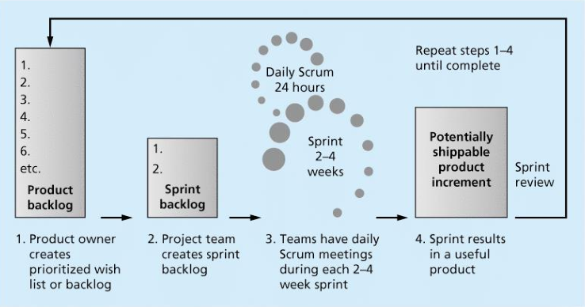
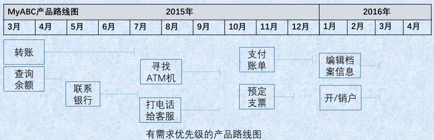
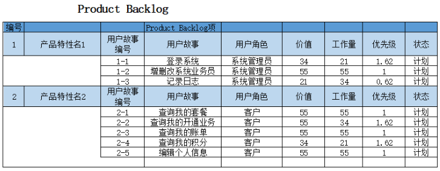
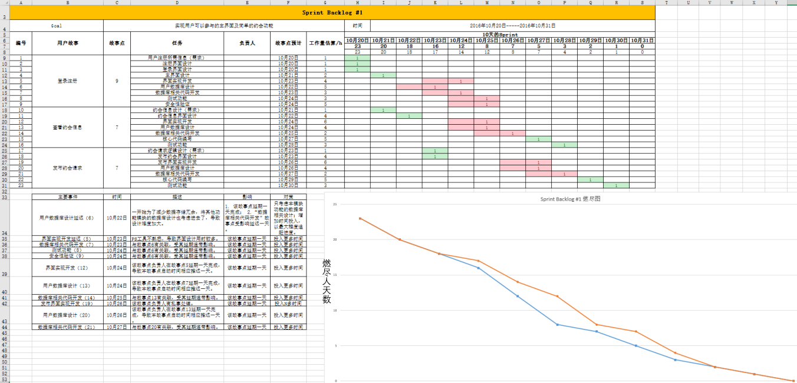
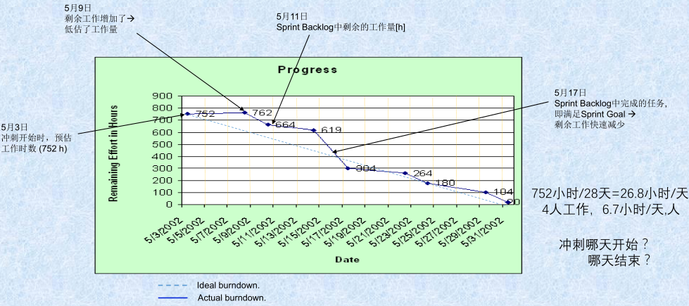

# 《敏捷开发项目管理》复习题：
考试题目有以下类型：判断题、选择题、简答题、分析设计题

## 主要复习提纲（以课件内容为主）：

### 1.  敏捷开发的[宣言](http://agilemanifesto.org/iso/en/manifesto.html)是什么？ 1P29
> 我们一直在实践中探寻更好的软件开发方法，身体力行的同时也帮助他人。由此我们建立了如下价值观：
> 个体和互动 高于 流程和工具
> 工作的软件 高于 详尽的文档
> 客户合作 高于 合同谈判
> 响应变化 高于 遵循计划
> 也就是说，尽管右项有其价值，我们更重视左项的价值。

### 2.  敏捷开发的12项原则和核心思想？ 1P35
敏捷开发的核心思想是：以人为本，适应变化

[敏捷开发的12个原则](http://agilemanifesto.org/iso/zhchs/principles.html)

1.  我们最重要的目标，是通过持续不断地及早交付有价值的软件使客户满意。
2.  欣然面对需求变化，即使在开发后期也一样。
3.  经常性地交付可以工作的软件。
4.  业务人员和开发人员必须相互合作。
5.  激发个体的斗志，以他们为核心搭建项目。
6.  面对面的交谈是传递信息效果最好效率也最高的方式。
7.  可工作的软件是进度的首要度量标准。
8.  敏捷过程倡导可持续开发。
9.  坚持不懈地追求技术卓越和良好设计。
10.  以简洁为本。
11.  最好的架构、需求和设计出自自组织团队。
12.  团队定期地反思如何能提高成效，并依此调整自身的举止表现。

### 3.  画出Scrum敏捷开发的框架 1P52

Product backlog -> Sprint backlog -> Sprint -> Sprint results -> Sprint review -> •

### 4.  敏捷核心价值观是什么? 什么是敏捷度量？ 1P65
敏捷宣言4个核心价值观
敏捷度量：项目是否成功取决于主观的判断，不能度量就不能管理
Value is what stakeholders expect from your project

### 5.  敏捷的角色、工件、仪式各有哪些？1P55 59 60
敏捷角色 (Scrum Roles)：产品负责人、Scrum主管、开发团队、干系人、敏捷导师
工件(Scrum Artifacts)：产品待办列表、冲刺待办列表、产品增量、燃尽图
仪式 (Scrum Ceremonies)：冲刺计划会议、每日例会、冲刺评审会议、冲刺回顾

### 6.  理解主要的敏捷软件开发框架：XP、ASD、FDD、TDD、AUP等  1P42/A3
* XP [eXetreme Programming](https://en.wikipedia.org/wiki/Extreme_programming) 极限编程：在客户有系统需求时，给予及时满意的可执行程序
* ASD [Adaptive Software Development](https://en.wikipedia.org/wiki/Adaptive_software_development) 自适应软件开发：强调开发方法的适应性，不像其他框架那样有很多具体的实践做法
* FDD [Feature-Driven Development](https://en.wikipedia.org/wiki/Feature-driven_development) 特征驱动开发：强调的是简化和实用，易于被开发团队接受，适用于需求经常变动的项目
* TDD [Test-Driven Development](https://en.wikipedia.org/wiki/Test-driven_development) 测试驱动开发：首先创建测试用例，然后开发软件通过测试
* AUP [Agile Unified Process](https://en.wikipedia.org/wiki/Agile_Unified_Process) 敏捷统一过程：以RUP为框架，对其进行适当的剪裁，并吸取其它敏捷方法的先进思想，以架构为中心、注重数据库设计和强调与用户的沟通。

### 7.  什么是愿景声明和产品路线图？并能够使用它们描述产品 2P4
#### 产品愿景声明 [Product Vision Statement](https://en.wikipedia.org/wiki/Vision_statement) 2P5
描述：产品目标和需求及其与业务战略关系的一致性，负责人：产品负责人，频率：至少每年一次
愿景声明实例
* 为了： <u>ABC银行客户</u>
* 谁： <u>需要随时随地访问银行的在线功能</u>
* 这个： <u>ABC银行的MyABC移动银行应用</u>
* 是一个： <u>能下载在智能手机和平板电脑上使用的移动银行</u>
* 它： <u>能让银行客户24小时用手机办理安全的、按需的银行业务</u>
* 不同于： <u>银行柜台的传统方法，和Web方法</u>
* 我们的产品： <u>用户可以通过手机操作办理银行业务</u>
* 附加说明： 该产品支持公司战略，为用户提供方便快捷的银行服务

#### 产品路线图 [Product Roadmap](https://www.productplan.com/what-is-a-product-roadmap/) 2P9
产品路线图是指产品需求的综合提示图，是产品需求的概览，也是组织开发过程的工具

创建产品路线图的步骤：
1. 识别产品需求
2. 整理产品特性（功能features）
3. 产品特性的估算和排序
4. 决定大致的时间框架

  

### 8.  敏捷工作实践中如何创建用户故事和估算用户故事？ 2P19
用户故事：是指一种对某个产品需求的简单描述（结合需求分析的用例图）
用户故事卡片：
 * 标题<名称>
 * 作为<用户 或 角色>
 * 我想<采取的行动>
 * 以便<能获得的益处>

创建用户故事的步骤：确定产品需求->和干系人协作完成产品需求描述->编写用户故事卡片

案例：移动售后服务用户故事
1. 作为：前台客服， 我希望：申请新客户，以便于：为客户开通一个新的账户（身份证—手机号—照片）
2. 作为：前台客服， 我希望：取消客户，以便于：删除一个客户的账号
3. 作为：前台客服， 我希望：为客户办理套餐， 以便于：指定的客户按照一种计费方式使用手机业务

估算用户故事，研发团队用估算扑克
1. 给每个成员一副扑克
2. 从一个简单的用户故事开始，给出一个估算作为故事点
3. PO选一个高优先级的用户故事
4. 根据故事点或对比已估算的用户故事，所有成员同时给出自己的分数扑克
5. 若分数不同 ，则讨论决定
   * 最高分和最低分分别解释
   * PO提供更多的故事细节
   * 所有成员再重新出牌，可有三次讨论
6. 若不能给出一致的分数，Scrum主管来协调
7. 对所有用户故事，重复3-6步骤

### 9.  掌握创建Product Backlog和Sprint Backlog的方法
#### 创建Product Backlog 2P32
Product Backlog是指确定了需求优先级的用户故事列表，例：
优先级 = 价值 / 工作量，确定哪些需求可以合并为一个可靠的发布

发布目标：完成核心业务，即作为<前台客服>，我希望<建立和删除一个客户，能为客户办理一项套餐业务>,以便于<完成客户的增删和基本业务>

#### 创建Sprint Backlog 2P41
Sprint Backlog 分解用户故事为任务

### 10. 什么是冲刺？冲刺的主要工作有哪些？ 2P38
冲刺：指一次迭代，并提交能够正常工作的产品。
一个冲刺的工作：开始时的冲刺计划、每日例会、开发时间—冲刺的主体、结束时的冲刺评审和冲刺回顾
只为当前的冲刺选择用户故事

### 11. 不同折线的燃尽图都说明什么问题？ 2P49
燃尽图须体现Sprint Backlog完成进展，即围绕Sprint Backlog的任务，与开发人员数量、周期、任务数量和时数等有关
燃尽图的时数（纵坐标）不包含冲刺的计划、评审和回顾时间
  

### 12. 冲刺评审会议与冲刺回顾会议有什么不同？ 2P89
冲刺结束的两个会议：
 * 冲刺评审(sprint review)会议：展示工作，展示工作。由产品负责人向用户代表和干系人展示用户故事
 * 冲刺回顾(sprint retrospectives)：评审冲刺，改进流程。开发团队、产品负责人、Scrum主管一起回顾本次冲刺

### 13. 敏捷工程实践有哪些？ 2P73
结对编程、持续集成、测试驱动开发、重构、站立会议、冲刺开发等

### 14. 敏捷管理主要有哪几方面？实现敏捷转型的系统工程？ 3P14 3P21
**敏捷管理**主要有：团队活动，时间管理，成本管理，沟通管理与干系人管理，质量与风险管理，项目集成管理，范围与采购管理
**敏捷转型**是系统工程，覆盖7个方面：实践、组织、过程、绩效考核、管控、文化、技术和业务调整

### 15. 传统项目管理的知识领域？项目和项目管理的基本概念？ 3P3
**项目**是指一系列独特的、复杂的并相互关联的活动，这些活动有着一个明确的目标或目的，必须在特定的时间、预算、资源限定内，依据规范完成。

**项目管理**是运用管理的知识、工具、和技术于项目活动上，来达成解决项目的问题或达成项目的需求。
传统项目管理的知识领域：集成、范围、时间、成本、质量、人力资源、沟通、风险、采购、干系人

### 16. 项目成本管理的方法？ 3P17
无论是传统项目管理还是敏捷项目管理，财务管理都是核心
财务计划方法：NPV，ROI，Payback，盈亏平衡点等计算和分析
财务监控方法：EVM（Earned Value Management）--监控成本/进度
