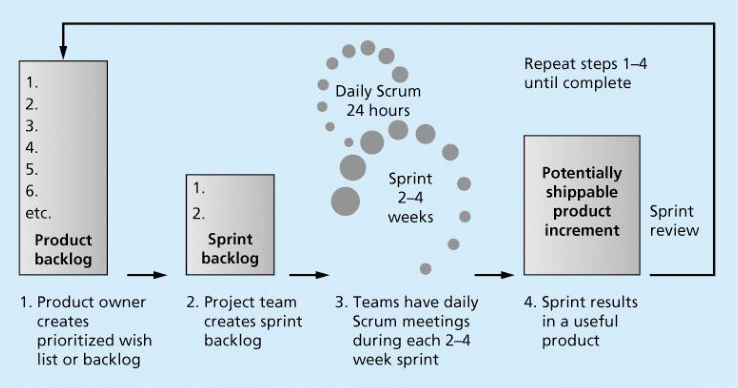
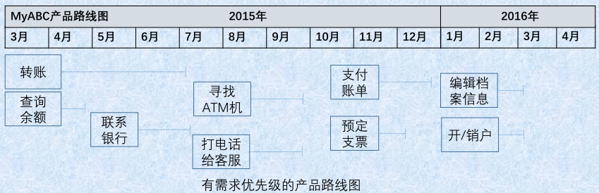
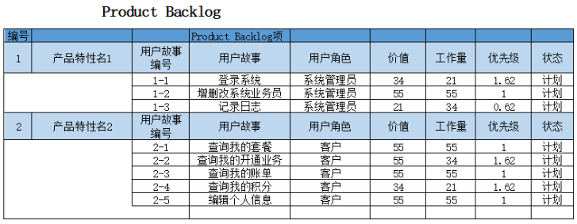
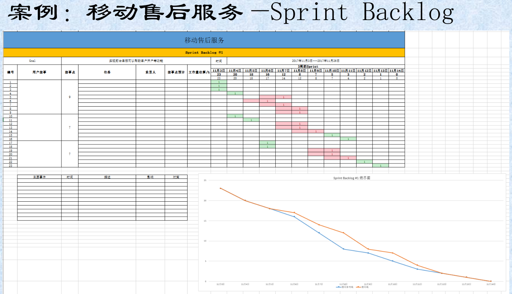
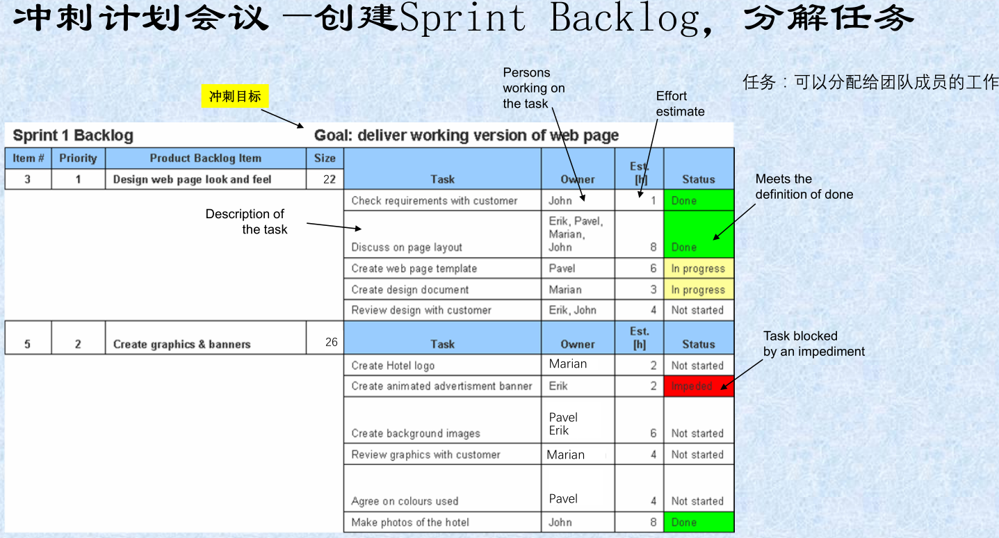
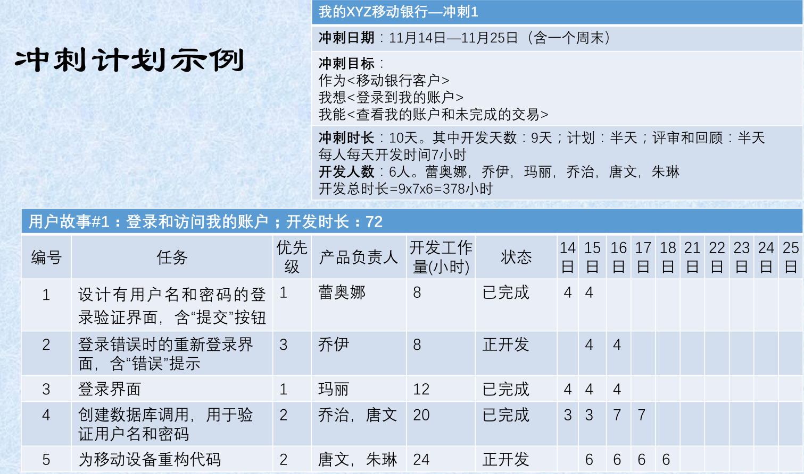
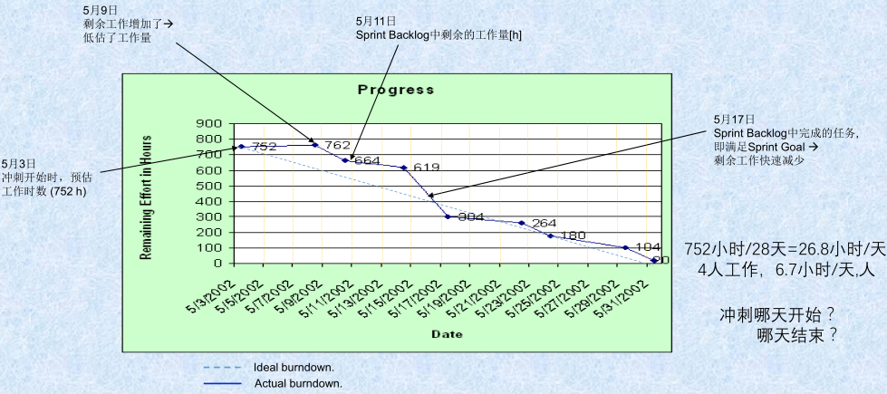
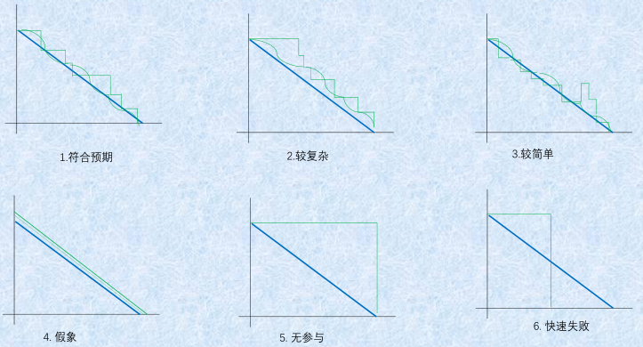
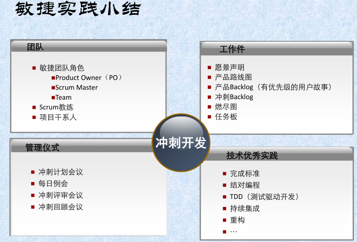

# 《敏捷开发项目管理》复习题：
考试题目有以下类型：判断题、选择题、简答题、分析设计题

## 主要复习提纲（以课件内容为主）：

### 1.  敏捷开发的[宣言](http://agilemanifesto.org/iso/en/manifesto.html)是什么？ 1P29
> We are uncovering better ways of developing software by doing it and helping others do it. Through this work we have come to value:  
>  Individuals and interactions over processes and tools  
>  Working software over comprehensive documentation  
>  Customer collaboration over contract negotiation  
>  Responding to change over following a plan  
> That is, while there is value in the items on the right, we value the items on the left more.  

> 我们一直在实践中探寻更好的软件开发方法，身体力行的同时也帮助他人。由此我们建立了如下价值观：  
> 个体和互动 高于 流程和工具  
> 工作的软件 高于 详尽的文档  
> 客户合作 高于 合同谈判  
> 响应变化 高于 遵循计划  
> 也就是说，尽管右项有其价值，我们更重视左项的价值。  

### 2.  敏捷开发的12项原则和核心思想？ 1P35

敏捷开发的核心思想是：以人为本，适应变化

> [Agile software development principles](http://agilemanifesto.org/iso/en/principles.html)
> 1.  Our highest priority is to satisfy the customer through early and continuous delivery of valuable software.
> 2.  Welcome changing requirements, even in late development. Agile processes harness change for the customer's competitive advantage.
> 3.  Deliver working software frequently, from a couple of weeks to a couple of months, with a preference to the shorter timescale.
> 4.  Business people and developers must work together daily throughout the project.
> 5.  Build projects around motivated individuals. Give them the environment and support they need, and trust them to get the job done.
> 6.  The most efficient and effective method of conveying information to and within a development team is face-to-face conversation.
> 7.  Agile processes promote sustainable development. The sponsors, developers, and users should be able to maintain a constant pace indefinitely.
> 8.  Sustainable development, able to maintain a constant pace
> 9.  Continuous attention to technical excellence and good design enhances agility.
> 10.  Simplicity--the art of maximizing the amount of work not done--is essential.
> 11.  The best architectures, requirements, and designs emerge from self-organizing teams
> 12.  At regular intervals, the team reflects on how to become more effective, then tunes and adjusts its behavior accordingly.

[敏捷开发的12个原则](http://agilemanifesto.org/iso/zhchs/principles.html)
1.  我们最重要的目标，是通过持续不断地及早交付有价值的软件使客户满意。
2.  欣然面对需求变化，即使在开发后期也一样。为了客户的竞争优势，敏捷过程掌控变化。
3.  经常性地交付可以工作的软件。相隔几星期或一两个月，倾向于采取较短的周期。
4.  业务人员和开发人员必须相互合作，项目中的每一天都不例外。
5.  激发个体的斗志，以他们为核心搭建项目。提供所需的环境和支援，辅以信任，从而达成目标。
6.  不论团队内外，传递信息效果最好效率也最高的方式是面对面的交谈。
7.  可工作的软件是进度的首要度量标准。
8.  敏捷过程倡导可持续开发。责任人、开发人员和用户要能够共同维持其步调稳定延续。
9.  坚持不懈地追求技术卓越和良好设计，敏捷能力由此增强。
10.  以简洁为本，它是极力减少不必要工作量的艺术。
11.  最好的架构、需求和设计出自自组织团队。
12.  团队定期地反思如何能提高成效，并依此调整自身的举止表现。

### 3.  画出Scrum敏捷开发的框架 1P52
  
Product backlog -> Sprint backlog -> Sprint -> Sprint results -> ·  

### 4.  敏捷核心价值观是什么? 什么是敏捷度量？ 1P65

敏捷宣言4个价值观

Scrum的[5个价值观](http://www.scrumcn.com/agile/scrum-knowledge-library/scrum.html)：承诺、专注、开放、尊重、勇气
* 承诺(Commitment) – 愿意对目标做出承诺
* 专注(Focus) – 把你的心思和能力都用到你承诺的工作上去
* 开放(Openness) – Scrum 把项目中的一切开放给每个人看
* 尊重(Respect) – 每个人都有他独特的背景和经验
* 勇气(Courage) – 有勇气做出承诺，履行承诺，接受别人的尊重  

敏捷度量：项目是否成功取决于主观的判断，不能度量就不能管理  
Value is what stakeholders expect from your project，Value度量组成：  
  User 40%  ： Feature importance 70%, Featrue frequency of use 30%  
  Sponsor 30%  : Revenue generation 50%, Customer experience 50%  
  Organization 20%  : Somplicity 60%, Compliance 40%  
  Team 10%  : Skills development 100%  

### 5.  敏捷的角色、工件、仪式各有哪些？
#### 敏捷的角色 (Scrum Roles) 1P55

* Product Owner （产品负责人）: The person responsible for the business value of the project and for deciding what work to do and in what order, as documented in the product backlog.
* Scrum Master （Scrum 主管）: The person who ensures that the team is productive, facilitates the daily Scrum, enables close cooperation across all roles and functions, and removes barriers that prevent the team from being effective.
* Scrum team or development team （开发团队）: A cross-functional team of five to nine people who organize themselves and the work to produce the desired results for each sprint, which normally lasts 2-4 weeks.
* Stakeholder（干系人）： Stakeholders are the people involved in or affected by project activities.
* Agile Mentor（敏捷导师）： 熟悉敏捷开发模式及敏捷实施流程的人员。

#### 工件 (Scrum Artifacts) 1P59

An artifact is a useful object created by people

* Product backlog（产品待办列表）: A list of features prioritized by business value
* Sprint backlog（冲刺待办列表）: The highest-priority items from the product backlog to be completed within a sprint
* Product Increment（产品增量）：A usable product is delivered
* Burndown chart（燃尽图）: Shows the cumulative work remaining in a sprint on a day-by-day basis

#### 仪式 (Scrum Ceremonies) 1P60

* Sprint planning session（冲刺计划会议）: A meeting with the team to select a set of work from the product backlog to deliver during a sprint.
* Daily Scrum（每日例会）: A short meeting for the development team to share progress and challenges and plan work for the day.
* Sprint reviews（冲刺评审会议）: A meeting in which the team demonstrates to the stakeholders and product owner what it has completed during the sprint.
* Sprint retrospectives（冲刺回顾会议）: A meeting in which the team looks for ways to improve the product and the process based on a review of the actual performance of the development team.

### 6.  理解主要的敏捷软件开发框架：XP、ASD、FDD、TDD、AUP等  1P42/A3
* XP [eXetreme Programming](https://en.wikipedia.org/wiki/Extreme_programming) 极限编程 1P43
  在客户有系统需求时，给予及时满意的可执行程序
* ASD [Adaptive Software Development](https://en.wikipedia.org/wiki/Adaptive_software_development) 自适应软件开发
  强调开发方法的适应性，不像其他框架那样有很多具体的实践做法
* FDD [Feature-Driven Development](https://en.wikipedia.org/wiki/Feature-driven_development) 特征驱动开发
  强调的是简化和实用，易于被开发团队接受，适用于需求经常变动的项目
* TDD [Test-Driven Development](https://en.wikipedia.org/wiki/Test-driven_development) 测试驱动开发 1P70
  首先创建测试用例，然后开发软件通过测试
* AUP [Agile Unified Process](https://en.wikipedia.org/wiki/Agile_Unified_Process) 敏捷统一过程
  以RUP为框架，对其进行适当的剪裁，并吸取其它敏捷方法的先进思想，以架构为中心、注重数据库设计和强调与用户的沟通。

### 7.  什么是愿景声明和产品路线图？并能够使用它们描述产品 2P4
#### 产品愿景声明 [Product Vision Statement](https://en.wikipedia.org/wiki/Vision_statement) 2P5
描述：产品目标和需求及其与业务战略关系的一致性，负责人：产品负责人，频率：至少每年一次  
愿景声明实例
* 为了： <u>ABC银行客户</u>
* 谁： <u>需要随时随地访问银行的在线功能</u>
* 这个： <u>ABC银行的MyABC移动银行应用</u>
* 是一个： <u>能下载在智能手机和平板电脑上使用的移动银行</u>
* 它： <u>能让银行客户24小时用手机办理安全的、按需的银行业务</u>
* 不同于： <u>银行柜台的传统方法，和Web方法</u>
* 我们的产品： <u>用户可以通过手机操作办理银行业务</u>
* 附加说明： 该产品支持公司战略，为用户提供方便快捷的银行服务

#### 产品路线图 [Product Roadmap](https://www.productplan.com/what-is-a-product-roadmap/) 2P9
产品路线图是指产品需求的综合提示图，是产品需求的概览，也是组织开发过程的工具  
创建产品路线图的步骤： 

1. 识别产品需求（即产品需求分解的过程）  
  通过愿景声明，确定需求的**主题**——是最高层次的需求  
  分析需求主题的**特性**，即拆分为具有若干特性的需求

2. 整理产品特性（功能features） 
  
|主要功能|产品特征|
|---|---|
|  |  |

  * 实例：移动银行应用 
  * 特性：账户管理、交易管理、客服管理 
  * 史诗故事： 
    * 账户信息：登录验证、VIP、个人信息修改  
    * 交易管理：支付、账单管理  
    * 客服功能：查询余额、理财、自动付款  
  * 用户故事：登录验证、VIP、个人信息修改、支付、账单管理、查询余额、理财、自动付款  
  * 任务：登录验证：输入用户名/账号，输入密码…  

3. 产品特性的估算和排序  
  
|主要功能|产品特性|价值|工作量|相对优先级|
|---|---|---|---|---|
|   |   |   |   |   |

  * 目的：确定核心需求，识别需求差异  
  * 给需求价值和工作量打分，或价值打分、工作量打分    
  * 可以用两组人分别打分：  
    * 产品负责人和客户及干系人为需求价值打分  
    * 开发团队为需求工作量打分  
  * 用Fibonacci数列作为分值： 用相对分数  
    * 产品路线图的需求：分数在55—144 （主题、特性）  
    * 发布计划的需求：分数在13—34 （史诗故事）  
    * 冲刺计划的需求：分数在1—8 （用户故事）  
  * 确定需求之间的依赖关系  
  * 计算相对优先级：可以帮助产品负责人对需求优先级排序，相对优先级=价值/工作量

4. 决定大致的时间框架  
  * 根据产品特性的相对优先级排序，创建产品路线图  
  * 优先级高的排在完成时间的前面  
  * 当确定了产品路线图，可以确定产品发布时间  
  * 根据产品发布的优先级，确定大致的产品迭代时间增量  
  

### 8.  敏捷工作实践中如何创建用户故事和估算用户故事？ 2P19
用户故事：是指一种对某个产品需求的简单描述（结合需求分析的用例图）
用户故事卡片：
 * 标题<名称>
 * 作为<用户 或 角色>
 * 我想<采取的行动>
 * 以便<能获得的益处>

创建用户故事的步骤  2P23
 * 识别项目干系人：专家、管理者、普通用户、技术用户等
 * 识别客户：即使用该产品的人（角色），细分客户类型和特点
 * 创建用户故事：
   * 确定产品需求
   * 和干系人协作完成产品需求描述
   * 编写用户故事卡片

案例：移动售后服务用户故事
1. 作为：前台客服， 我希望：申请新客户，以便于：为客户开通一个新的账户（身份证—手机号—照片）
2. 作为：前台客服， 我希望：取消客户，以便于：删除一个客户的账号
3. 作为：前台客服， 我希望：为客户办理套餐， 以便于：指定的客户按照一种计费方式使用手机业务

估算用户故事 2P29
研发团队用估算扑克
1. 给每个成员一副扑克
2. 从一个简单的用户故事开始，给出一个估算作为故事点
3. PO选一个高优先级的用户故事
4. 根据故事点或对比已估算的用户故事，所有成员同时给出自己的分数扑克
5. 若分数不同 ，则讨论决定
   * 最高分和最低分分别解释
   * PO提供更多的故事细节
   * 所有成员再重新出牌，可有三次讨论
6. 若不能给出一致的分数，Scrum主管来协调
7. 对所有用户故事，重复3-6步骤

### 9.  掌握创建Product Backlog和Sprint Backlog的方法
#### 创建Product Backlog 2P32
优先级 = 价值 / 工作量，确定哪些需求可以合并为一个可靠的发布  
Product Backlog是指确定了需求优先级的用户故事列表，例：
  

#### 创建Sprint Backlog 2P41

#### Sprint Backlog示例：分解用户故事为任务  
目标：作为一名移动银行客户，我想要登录我的账号，以便查看我的账户余额，正在处理的交易、和历史交易记录  
选择的用户故事：
  1. 登录和访问我的账户；
  2. 查看账户余额；
  3. 查看正在处理的交易；
  4. 查看先前的交易

登录和访问我的账户的任务分解：
  1. 设计有用户名和密码的登录验证界面，含“提交”按钮
  2. 登录错误时的重新登录界面，含“错误”提示
  3. 登录界面
  4. 创建数据库调用，用于验证用户名和密码
  5. 为移动设备重构代码
冲刺时长：10个工作日，其中9天开发，半天计划，半天评审和回顾（两周）  
参加人数：6人，每人每天开发时间7小时，则总开发时间=9x7x6=378人时  

### 10. 什么是冲刺？冲刺的主要工作有哪些？ 2P38
冲刺：指一次迭代，并提交能够正常工作的产品。一个冲刺的工作：
1. 开始时的冲刺计划
2. 每日例会
3. 开发时间—冲刺的主体
4. 结束时的冲刺评审和冲刺回顾

只为当前的冲刺选择用户故事

### 11. 不同折线的燃尽图都说明什么问题？ 2P49
* 燃尽图须体现Sprint Backlog完成进展，即围绕Sprint Backlog的任务  
* 燃尽图与开发人员数量、周期、任务数量和时数等有关  
* 燃尽图的纵坐标也可以是
  * 工作时数：时间粒度太小，估算较费时，且冲刺后期可能需较大调整
  * 工作人天数：按照几人几天总数估算，粒度比时数估算要大，且可以了解每人完成情况，冲刺后期调整不大
  * 任务点数：任务越多，则折线越多。不能反映任务的用时情况，即不能了解时间进度
* 燃尽图的时数（纵坐标）不包含冲刺的计划、评审和回顾时间

### 12. 冲刺评审会议与冲刺回顾会议有什么不同？ 2P89
冲刺结束的两个会议：
 * 冲刺评审(sprint review)会议：展示工作，收集反馈。由产品负责人向用户代表和干系人展示用户故事
 * 冲刺回顾(sprint retrospectives)：评审冲刺，改进流程。开发团队、产品负责人、Scrum主管一起回顾本次冲刺

### 敏捷工程实践有哪些？ 2P73
结对编程、持续集成、测试驱动开发、重构、站立会议、冲刺开发等

### 14. 敏捷管理主要有哪几方面？实现敏捷转型的系统工程？ 3P14 3P21
**敏捷管理**主要有：团队活动，时间管理，成本管理，沟通管理与干系人管理，质量与风险管理，项目集成管理，范围与采购管理  
**敏捷转型**是系统工程，覆盖7个方面：实践、组织、过程、绩效考核、管控、文化、技术和业务调整

### 15. 传统项目管理的知识领域？项目和项目管理的基本概念？ 3P3
**项目**是指一系列独特的、复杂的并相互关联的活动，这些活动有着一个明确的目标或目的，必须在特定的时间、预算、资源限定内，依据规范完成。  
**项目管理**是运用管理的知识、工具、和技术于项目活动上，来达成解决项目的问题或达成项目的需求。  
传统项目管理的知识领域：集成、范围、时间、成本、质量、人力资源、沟通、风险、采购、干系人  

### 16. 项目成本管理的方法？ Cost
* 估算成本是对完成项目活动所需资金进行近似估算的过程。根据已知信息所做出的成本预测。
* 估算成本过程包括：
  1. 识别可用于启动与完成项目的可替代成本方案；即都有哪些备选方案
  2. 考虑、权衡备选成本方案和风险，例如：
    * 比较自制成本与外购成本、
    * 购买成本与租赁成本
    * 多种资源共享方案—是否能够共享开发人员？
  3. 优化项目成本：与开发方案共同讨论，找出优化的方案

* 要估算的成本有：花费在项目上的全部资源，包括（但不限于）人工、材料、设备、服务、设施，以及一些特殊的成本种类，如通货膨胀补贴、融资成本或应急成本。
* 随着项目信息越来越明确，可以动用、减少或取消应急储备。
* Man-Month(人月)或Man-Hour(人时)是衡量工作量的计量单位，是项目所有参与者工作时长的累计，是用于估算开发成本的
* Man-Month或Man-Hour与项目时长（time  or schedule）没有关系，项目时长是由项目中的关键路径（critical path）决定的
* 《The Mythical Man-month》: 软件开发人员的数量和开发时间是不可以相互替换的

无论是传统项目管理还是敏捷项目管理，财务管理都是核心   
财务计划方法：NPV，ROI，Payback，盈亏平衡点等计算和分析    
财务监控方法：EVM（Earned Value Management）--监控成本/进度  

### Assignments Q&A
* 需求分析的工具: 用例图、业务时序图等如何运用到敏捷开发的产品路线图和发布计划？  
 用例图和业务时序图是描述需求的工具，在敏捷开发的产品路线图过程中，可以作为识别产品需求、整理产品特征的辅助工具，在发布计划过程中，可以作为 细化需求、创建用户故事的辅助工具；

* 如何提高用户故事分解的效率，是否应该团队成员协商共同完成?  
 PPT上有拆分用户故事，为提高用户故事的分解效率，应该团队成员协同完成，因为用户故事的分解是创建Product backlog的重要准备工作，与开发任务分配有着密切的关系，所以要由团队成员共同完成；

* 请假、加班、添加或删除任务如何填写燃尽图？  
 单纯的燃尽图只反映Sprint Backlog 中任务的完成进展情况，与开发人员是否请假或加班无关，但是如果请假影响了进度，燃尽图能反映出来，就需要srcum主管介入并解决进度推后的问题。如果有任务增加或删除，Sprint Backlog会有变化（可以是第二版），要有对应新版本Sprint Backlog的燃尽图。
