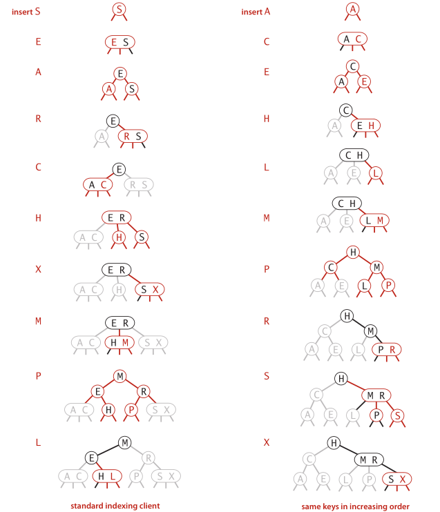
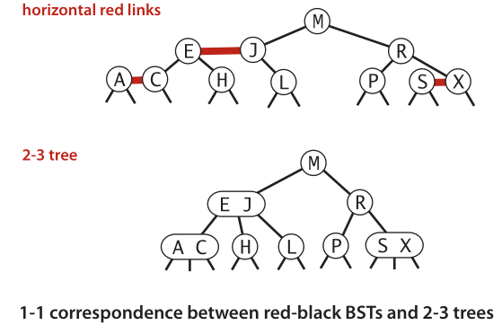
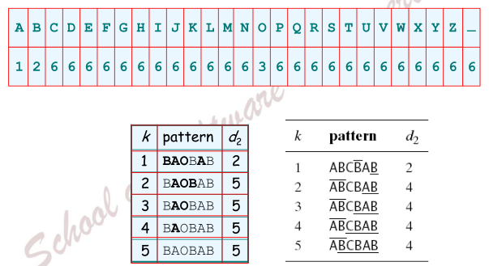
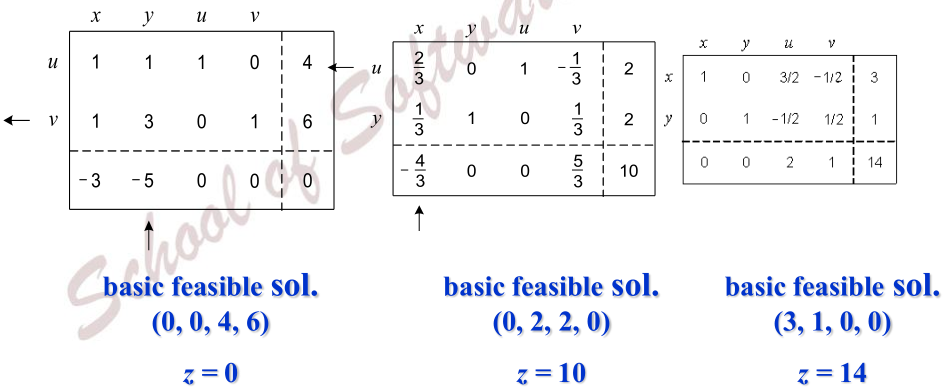

# FOR EXAM

## 1. Complexity of recursive algorithms

| notation  | provides          | example | used to                   |
| --------- | ----------------- | ------- | ------------------------- |
| Big Theta | asymptotic        | Θ(N²)   | classify algorithms       |
| Big Oh    | Θ(N²) and smaller | O(N²)   | develop **upper bounds**  |
| Big Omega | Θ(N²) and larger  | Ω(N²)   | develop **lower bounds**  |
| Tilde     | leading term      | ~ 10 N² | provide approximate model |


## 2. Merge sort, Quick sort, Closest point pair, Convex hull

### Merge sort

```
# pseudocode
mergesort(A, start, end)
    if end - start < 3
        let A[start:end] sorted
        return
    m = (start + end) / 2
    mergesort(A, start, m)
    mergesort(A, m + 1, end)
    merge(A, start, m, end)
```


### Quick sort

```python
import random
def partition(A, start, end):
    i = start + 1
    j = end
    while i <= j:
        if A[j] < A[start]:
            A[i], A[j] = A[j], A[i]
            i = i + 1
        else:
            j = j - 1
    A[start], A[j] = A[j], A[start]
    return j


def quicksort(A, start, end):
    if end <= start:
        return
    m = partition(A, start, end)
    quicksort(A, start, m - 1)
    quicksort(A, m + 1, end)
```


### Closest point pair

```
# S is sorted by x-coordinate values
# pseudocode

closet_pair(S, start, end)
    if end - start < 3
        return cloest_pair
    m = (end + start) / 2
    closet_left = closet_pair(S, start, m)
    closet_right = closet_pair(S, m+1, end)
    clo = min(closet_left, closet_right)
    closet_mid = closet val whose x-coordinate in (S[m].x - clo, s[m].x + clo)
    return min(clo, closet_mid)
```


### Convex hull

```
# pseudocode

ALGO convex_hull(S)
    sort s by y-coordinate values
    p = S[0]
    Sort S by polar angle with p, S[0], S[1] are in convex hull
    push s[0], s[1] to convex hull stack
    for i = 2 to len(S) - 1
        while (cross product of hull[top-1]-hull[top-2] and S[i]-hull[i-2]) <= 0
            pop the top of convex hull stack
        push S[i]
```


## 3. DFS BFS

Depth-first search use stack, Breadth-first search use queue

(DFS) Finding Articulation Points：

* No leaf is an articulation point
* Root is an articulation point only if it has 2 or more children


* An internal node *u* is an articulation point (cut vertex) only if for any sub-tree of *u*, there is no back edge from a node in this sub-tree to a proper ancestor of *u* in DFS


## 4. Heap, AVL, R-B, 2-3

### [2-3 Tree](https://en.wikipedia.org/wiki/2%E2%80%933_tree)

一棵2-3查找树或为空树，或由以下两种结点组成：

* 2-结点：含有一个键和两条链接，左小右大
* 3-结点：含有两个键和三条链接，左小中间右大

插入情况：

* 向2-结点中插入新键：2->3
* 向一棵只含有一个3-结点的树中插入新键：3->4（临时），树高+1
* 向一个父结点为2-结点的3-结点中插入新键：父结点2->3
* 向一个父结点为3-结点的3-结点中插入新键：3->4（临时），向上传递

在一棵大小为N的完美平衡2-3树中，查找和插入操作访问的结点必然不超过lgN个

构造示例：




### [Red-black Tree](https://en.wikipedia.org/wiki/Red%E2%80%93black_tree)

红黑树的基本思想是用二叉树来表示2-3树，将树的链接分为两种。

* *红链接* 将两个2-结点连接起来构成一个3-结点，将3-结点表示为由一条**左斜**的红链接相连的两个2-结点
* *黑链接* 是2-3树中的普通链接

将红链接画平时，一棵红黑树就是一棵2-3树




## 5. KMP, BM, Dynamic hashing

### [Boyer-Moore Algorithm](https://en.wikipedia.org/wiki/Boyer%E2%80%93Moore_string_search_algorithm)

ALGS4 method

```
# s is the source string of length n, p is the pattern string of length m
# pseudocode

ALGO boyer-morre(s, p)
    right[] init to -1
    for j = 0 to m - 1
        right[p[j]] = j

    i = 0
    while i <= m-n
        skip = 0
        for j = m - 1 to 0
            if s[i+j] != p[j]
                skip = max(1, j - right[s[i+j]])
                break
        if skip == 0
            return i
        i += skip
    return n
```

Bad-character rule and good-suffix rule：

- Fill in the *bad-character* shift table t1 and *good-suffix* shift table t2
- Align the pattern against the beginning of the text
- when mismatch after k matches 
  - $d_1 = max\{t_1(c) - k, 1\}$ 
  - $ d_2 = t_2(k)$





### [Extendible hashing](https://en.wikipedia.org/wiki/Extendible_hashing)

If the bucket is full:

1. If the local depth is equal to the global depth, then there is only one pointer to the bucket, and there is no other directory pointers that can map to the bucket, so the directory must be doubled.
2. If the local depth is less than the global depth, then there exists more than one pointer from the directory to the bucket, and the bucket can be split.


## 6. Prim, Kruscal, Dijkstra, Huffman


## 7. DP (Pseudocode needed)

### [Knapsack problem](https://en.wikipedia.org/wiki/Knapsack_problem)

```
# 0-1 knapsack pseudocode
# f[i,j] 表示前i件物品放入一个容量为j的背包可以获得的最大价值
# f[i,j] = max(f[i-1,j], f[i-1,j-cost[i]] + weight[i])
f[0..v] = 0
for i = 1 to n
    for j = v to cost[i]
        f[j] = max(f[j], f[j-cost[i]] + weight[i])
        
# Unbounded knapsack pseudocode
# f[i,j] 表示前i件物品放入一个容量为j的背包可以获得的最大价值
# f[i,j] = max(f[i-1,j], f[i,j-cost[i]] + weight[i])
f[0..v] = 0
for i = 1 to n
    for j = cost[i] to v
        f[j] = max(f[j], f[j-cost[i]] + weight[i])
```


## 8. A\*, B&B, Hill Climbing, BestFS

### [A* search algorithm](https://en.wikipedia.org/wiki/A*_search_algorithm)

A\*算法是对BFS的优化（dijkstra算法即A\*中所有h(v)都为0的特殊情况），IDA\*是对DFS的优化

A\*算法的描述（[something related](https://www.redblobgames.com/pathfinding/a-star/introduction.html)）：

1. 给出状态v到目标状态的距离下界的估算函数h(v)
2. 将BFS中优先队列的键改为d(v) + h(v)，d(v)是初始状态到状态v的距离


### [Branch and bound](https://en.wikipedia.org/wiki/Branch_and_bound)

*Backtracking* for all solution use DFS, *B&B* for one solution use BFS

分支限界法只将扩展结点满足限界函数的子结点加入活结点队列

### [Hill climbing](https://en.wikipedia.org/wiki/Hill_climbing)

从任意解开始寻找更优解，直到找不到更优解

### [Best-first search](https://en.wikipedia.org/wiki/Best-first_search)

BFS use  [priority queue](https://en.wikipedia.org/wiki/Priority_queue), ([something related](http://blog.csdn.net/qq_28781071/article/details/51548104))

- A算法：最佳优先搜索算法我们也称为A算法（algorithm A）。
- 可采纳性（Admissibility）：一个搜索算法如果能找到最短路径（也就是最优解），我们称这个算法为可采纳的。
- A\*算法：一个可采纳的A算法，我们称为[A\*算法](https://en.wikipedia.org/wiki/A*_search_algorithm)（[A* algorithm](https://en.wikipedia.org/wiki/A*_search_algorithm)）。
- 单调性：如果一个启发估价函数满足以下条件，我们称这个估价函数是单调的：
  1. 对于任意的节点i，j，j为i的子节点：h(i) – h(j) <= cost(i, j)
  2. 目标节点的估价为0，h(goal) = 0。
- 贪婪最佳优先搜索（Greedy Best-First Search）：在估价函数当中，当h(n)比g(n)大很多，此时仅有h(n)对估价起作用是，我们称这种算法为贪婪最佳优先搜索。


## 9. Simplex algorithm, Network flow

### [Simplex algorithm](https://en.wikipedia.org/wiki/Simplex_algorithm)

$$
\begin{equation}
  \begin{aligned}
    {\bf max}\quad & z = 3x_1 + 5x_2 \\
    {\bf s.t}\quad &
    \begin{aligned}
      &x_1+x_2 &\le4 \\
      &x_1 + 3x_2 &\le 6 \\
      &x_1 , x_2 &\ge 0
    \end{aligned}
  \end{aligned}
  \quad\xrightarrow{\;standardize\;}\quad
  \begin{aligned}
    {\bf max} \quad &z = 3x_1 + 5x_2  +0x_3 + 0x_4\\
    {\bf s.t} \quad &
    \begin{aligned}
      & x_1+x_2 + x_3 &= 4 \\
      & x_1 + 3x_2  + x_4 &= 6 \\
      & x_1 , x_2, x_3, x_4 &\ge 0
    \end{aligned}
  \end{aligned}
\end{equation}
$$

1. 选择最后一行中绝对值最大的列
2. 选择最后一列除以该列所得值最小的行，该行的基本变量变为非基本变量
3. 直到最后一行没有负数




### [Maxflow problem](https://en.wikipedia.org/wiki/Maximum_flow_problem)

[**Ford-Fulkerson algorithm**](https://en.wikipedia.org/wiki/Ford%E2%80%93Fulkerson_algorithm) 

*Augmenting path.*  Find an undirected path from s to t such that:

* Can increase flow on forward edges (not full).
* Can decrease flow on backward edge (not empty).

```
# Ford-Fulkerson algorithm
Start with 0 flow.
While there exists an augmenting path:
 - find an augmenting path
 - compute bottleneck capacity
 - increase flow on that path by bottleneck capacity
```


## 10. Parallel sorting (Enumeration Sort, PSRS)

### Enumeration sort algorithm

对A[1...n]排序，生存n个进程，第i个进程计算A中比A[i]小的元素个数

```
ALGO esort(A)
    for i = 1 to n
        create peocess i
    process i:
        k = 0
        for j = 1 to n
            if A[i] > A[j] or (A[i] == A[j] and i > j)
                k = k + 1
        R[k+1] = A[k]
```


[Parallel sorting by regular sampling](http://csweb.cs.wfu.edu/bigiron/LittleFE-PSRS/build/html/PSRSalgorithm.html)

设待处理里序列长n，并行机上有p个处理器。为了使问题简单，我们假设n是p的整倍数。于是将这n个元素划分为p段，每段中有n/p个元素，将这p段分给p个处理器。

1.  让各个处理器并行的调用串行排序算法进行局部排序；
2.  从每个有序段中选p个样本元素，共p^2个样本元素（采样）；
3.  对样本元素排序；
4.  从样本元素中选p-1作为划分元素，并播送给其余的处理器；
5.  各个处理器根据划分元素对局部序列进行划分（分为p段）；
6.  各个处理器将每一段按段号交换到相应序列号的处理器；
7.  在各个处理器中使用串行算法再次进行局部排序。